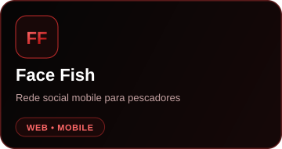
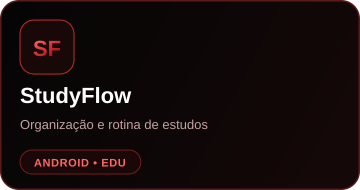
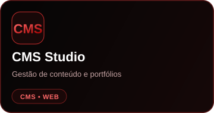

 

### Estudante de Técnico em Informática para Internet

**Web Developer • Code • Design • Build • Improve**

HTML • CSS • JavaScript  
Sempre criando algo novo.

 

---

## Sobre mim

Sou estudante de **Técnico em Informática para Internet** e desenvolvedor focado em criar aplicações modernas, interfaces responsivas e sistemas completos.

**Web Developer • Code • Design • Build • Improve**

Sempre criando algo novo e evoluindo meus conhecimentos em desenvolvimento.

**Atualmente trabalhando com:**
- Desenvolvimento Web
- Aplicativos Mobile
- UI/UX
- Sistemas e dashboards
- Inteligência Artificial aplicada a produtos digitais
- Cloudflare e deploy

---

## Stack

---

## Projetos em destaque

---

## GitHub Stats

---

**BUILDING • LEARNING • CREATING**

`@devnicozz`

