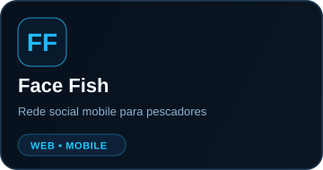
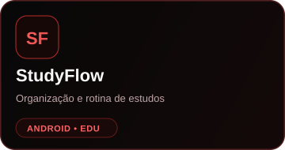
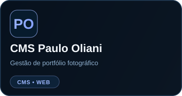

 

### Desenvolvedor Web & Mobile

Construindo experiências digitais modernas, rápidas e responsivas.

 

---

## Sobre mim

Sou desenvolvedor focado em criar aplicações modernas, interfaces responsivas e sistemas completos.

**Atualmente trabalhando com:**
- Desenvolvimento Web
- Aplicativos Mobile
- UI/UX
- Sistemas e dashboards
- Inteligência Artificial aplicada a produtos digitais
- Cloudflare e deploy

---

## Stack

---

## Projetos em destaque

---

## GitHub

---

## Atividade

---

**Building • Learning • Creating**

`@devnicozz`

