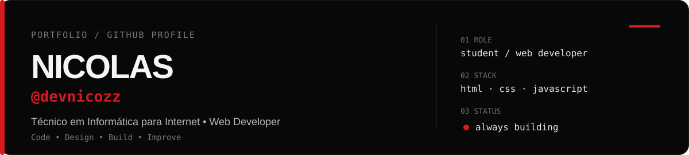

 

## Sobre

Estudante de **Técnico em Informática para Internet** e desenvolvedor web em formação.

Gosto de transformar ideias em interfaces, sistemas e produtos digitais que sejam simples de usar e bem construídos.

**Code · Design · Build · Improve**

Sempre criando algo novo.

---

## Ferramentas

`HTML` · `CSS` · `JavaScript` · `React` · `Android` · `Git` · `GitHub` · `Cloudflare` · `Figma` · `MySQL`

---

## Projetos selecionados

 

**Face Fish** — rede social e plataforma mobile voltada para pescadores, com perfis, feed, localização e interação.

**StudyFlow** — projeto de estudo focado em organização, conteúdo e experiência acadêmica.

**CMS Studio** — sistema de gerenciamento de conteúdo para sites, portfólios e dashboards.

---

## Atualmente

- aprofundando **HTML, CSS e JavaScript**
- estudando desenvolvimento para web e mobile
- criando projetos próprios para praticar produto, interface e código
- melhorando meus projetos a cada versão

---

devnicozz · building one project at a time.

