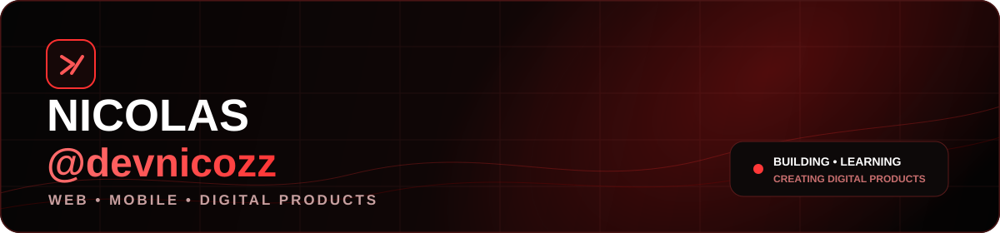

 

# Nicolas — @devnicozz

### Desenvolvedor Web & Mobile

Transformando ideias em aplicações modernas, sistemas e experiências digitais.

 

---

## Sobre mim

Sou desenvolvedor focado na criação de aplicações modernas, interfaces responsivas e sistemas completos.

Atualmente venho trabalhando em projetos próprios envolvendo:

- Desenvolvimento Web
- Aplicativos Mobile
- Sistemas de gerenciamento
- UI/UX
- Inteligência Artificial aplicada a projetos
- Cloudflare e deploy de aplicações

---

## Tecnologias

---

## Projetos em destaque

### Face Fish
Rede social e plataforma voltada para pescadores, com foco em experiência mobile, perfis, feed, localização e interação entre usuários.

### StudyFlow
Plataforma de estudos desenvolvida para organizar conteúdos, exercícios, desempenho e rotina acadêmica.

### CMS Paulo Oliani
Sistema de gerenciamento de conteúdo para administração de portfólio e projetos fotográficos.

---

## Estatísticas

---

## Atividade

---

### Building. Learning. Creating.

`devnicozz`

