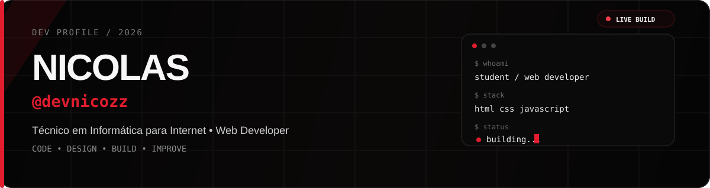
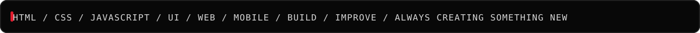
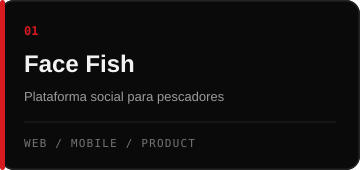
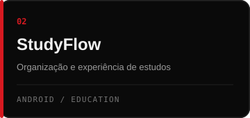
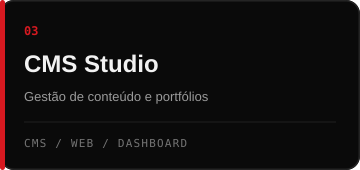

 

 

## Sobre

Estudante de **Técnico em Informática para Internet** e desenvolvedor web em formação.

Crio interfaces, sistemas e produtos digitais com foco em experiência, identidade visual e funcionamento real.

**Web Developer · Code · Design · Build · Improve**

Sempre criando algo novo.

---

## Ferramentas

---

## Projetos selecionados

 

**Face Fish** — plataforma social mobile voltada para pescadores, com perfis, feed, localização e interação.

**StudyFlow** — projeto de estudo focado em organização, conteúdo e experiência acadêmica.

**CMS Studio** — sistema de gerenciamento de conteúdo para sites, portfólios e dashboards.

---

## Agora

`> estudando` desenvolvimento web e mobile  
`> construindo` projetos próprios  
`> melhorando` HTML, CSS e JavaScript  
`> criando` interfaces e experiências digitais

---

**CODE • DESIGN • BUILD • IMPROVE**

@devnicozz

